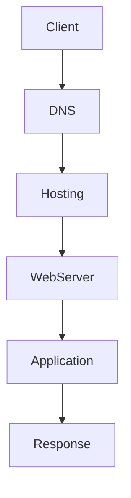

# Today - 2025-04-09 (Wed)

## Scrub
- 웹 호스팅과 웹 서버의 **내부 동작 원리**에 대해 구조적 관점에서 학습
- HTTP 요청이 클라이언트에서 발생하여 서버 응답으로 이어지는 전 과정을 분석

## Learned

### 웹 호스팅 내부 구조
- 웹 호스팅은 **웹 서비스를 위한 컴퓨팅 자원(서버, 저장공간, 네트워크)**을 패키지로 제공
- 주로 사용되는 유형:
  - **공유 호스팅**: 하나의 서버에 다수의 사용자 웹사이트 호스팅
  - **VPS(가상 전용 서버)**: 물리적 서버 내 일부 자원을 전용처럼 사용
  - **전용 서버/클라우드 서버 (IaaS)**: 사용자가 OS, 웹서버 설정 포함 모든 관리
  - **무서버(Serverless) / PaaS**: 배포 단순화 (ex. Netlify, Vercel)

> 웹 호스팅은 단순 저장 공간이 아닌, **웹 요청-응답 흐름을 위한 실행 환경 전체를 구성**함

### ✅ 웹 서버 동작 원리
1. 클라이언트가 브라우저에서 URL 입력
2. **DNS 조회**를 통해 도메인을 IP 주소로 변환
3. **TCP 연결** 수행 (HTTP/HTTPS 요청 전)
4. 웹 서버(Nginx, Apache 등)가 요청을 수신
5. 라우팅 설정에 따라 정적 파일 또는 동적 어플리케이션으로 연결 (ex. FastAPI, Node.js)
6. 서버는 **HTTP 응답**을 브라우저로 반환

- 정적 파일 제공: HTML, CSS, JS, 이미지 등 직접 응답
- 동적 라우팅 처리: 백엔드 서버와 연동하여 데이터 처리 후 결과 전달

### 웹 서버의 역할
| 기능 | 설명 |
|------|------|
| 요청 수신 | TCP 포트를 열고 HTTP/HTTPS 요청 대기 |
| 라우팅 처리 | 요청 URI에 따라 리소스 매핑 (정적/동적) |
| 응답 반환 | 200, 404, 500 등 HTTP 상태 코드와 함께 데이터 전송 |
| 리버스 프록시 | 다른 서버/애플리케이션으로 요청을 포워딩 (ex. API 서버 연결) |
| 캐싱 | 자주 조회되는 자원에 대해 서버 내부/클라이언트 캐시 적용 |

### 정리: 웹 호스팅 vs 웹 서버 흐름 구조

- DNS: 도메인 → IP 변환
- Hosting: 서버 환경 제공
- WebServer: HTTP 요청 처리
- Application: 동적 로직 처리 (ex. FastAPI, Flask 등)

## Keep
- 웹 서버가 단순히 파일을 반환하는 소프트웨어가 아니라 **HTTP 프로토콜 기반의 라우팅·응답 처리기**라는 관점이 명확해짐
- 요청의 흐름을 **DNS → TCP 연결 → 서버 응답**까지 체계적으로 정리한 점

## Problem
- AWS, Vercel, Netlify 등 PaaS 계열 호스팅 환경의 **구성 차이**와 선택 기준에 대한 정리는 미흡
- 실제 nginx.conf 기반 라우팅 설정 구성은 추상적 이해 수준

## Try
- 다음 목표: Nginx 리버스 프록시와 포스트 프록시 차이점 상세히 공부
- EC2에 대해서 자사히 공부

## 참고자료
- [웹 서버 동작 원리 - MDN Docs](https://developer.mozilla.org/ko/docs/Learn/Common_questions/Web_mechanics/How_does_the_Internet_work)