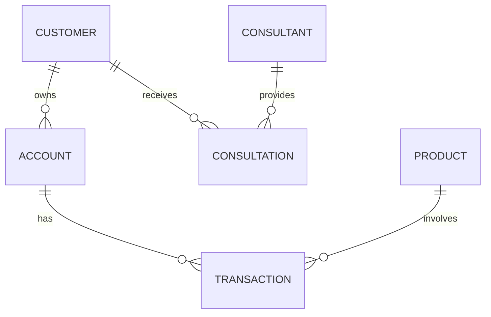

# Today - 2025-03-21 (Fri)

## Scrub
- ERD(Entity-Relationship Diagram)가 데이터베이스 설계의 효율성을 높이는 이유 학습

## Learned

### ERD란?
- 개체(Entity)와 관계(Relationship)를 시각적으로 표현한 도표
- 단순히 무엇이 있는지를 넘어서, **구조 + 의미 + 흐름**을 함께 담은 데이터 모델링 도구
- 관계형 스키마보다 **이해도, 협업, 분석**에 유리한 시각화 도구

### 구조화 → 관계 파악 → 통찰 도출

### 관계가 중요한 이유: 사례 분석

#### 1. CUSTOMER → CONSULTATION → CONSULTANT
- **상담 이력 분석**, **상담원 평가**, **맞춤형 재상담 알림**에 필수
- 중간 테이블(CONSULTATION)이 없으면 분석 불가

#### 2. TRANSACTION → PRODUCT
- **무엇을 거래했는가**에 대한 분석 가능
- 상품 선호도, 리스크 분석, 수익률 추적 등 **의사결정 지원**에 중요

### ERD의 구성 요소
- **Entity**: 사람, 사물, 이벤트 등 (예: 고객, 계좌)
- **Attribute**: 엔터티의 속성 (예: 이름, 금액)
- **Relationship**: 엔터티 간의 연결 (예: 소유한다, 구매한다)

### ERD 표기법 종류
- **Crow’s Foot Notation**: 복잡한 관계를 직관적으로 표현
- **Peter Chen Notation**: 관계와 속성을 세밀하게 표현 가능
- **Barker Notation**: 구조화된 관계 명확하게 표기

### ERD가 데이터베이스 설계에 필수인 이유

#### 1️⃣ 데이터 무결성 확보
- 설계 없이 DB 구현 시 제약 조건이 누락될 수 있음
- ERD를 통해 **데이터 정합성 보장**

#### 2️⃣ 협업/소통 도구
- 개발자, 기획자, 데이터 분석가 모두 이해 가능한 **공통 언어**

#### 3️⃣ 유지보수 및 확장성 향상
- 프로젝트 규모 확장 시 **구조 혼란 방지**
- 관계 및 흐름을 통해 기능 추가/변경 시 안정성 확보

#### 4️⃣ 자동화/문서화 기반 제공
- SchemaSpy, Lucidchart 등 연동 가능
- ERD를 통해 **데이터 흐름 추적, 분석 자동화** 가능

### ERD 없는 DB 설계 시 문제점
| 문제 | 영향 |
| --- | --- |
| 코드 기반 설계 | 구조 파악 불가, 협업 어려움 |
| 관계 누락 | 잘못된 데이터 입력, 분석 실패 |
| 문서 따로 관리 | 문서와 실제 DB 불일치 |
| 추측 기반 분석 | 데이터 왜곡, 리포트 오류 가능성 |

### 결론
| 항목 | ERD 있음 | ERD 없음 |
| --- | --- | --- |
| 관계 표현 | ✅ 명확 | ⚠️ 추정 가능 |
| 협업 | ✅ 빠름 | ❌ 지연, 해석 차이 |
| 유지보수 | ✅ 용이 | ❌ 혼란 증가 |
| 분석 | ✅ 가능 | ❌ 불완전 |
| 자동화 활용 | ✅ 가능 | ❌ 어려움 |

> "ERD는 단순한 도표가 아닌, **설계의 핵심 도구이자 시스템 생명선이다.**"

### 효율성 측면에서 ERD의 효과
- **설계**: 중복 제거, 안정성 확보
- **개발**: 기능 간 충돌 방지, 디버깅 용이
- **운영**: 장애 대응, 데이터 흐름 추적
- **협업**: 커뮤니케이션 단축, 오해 최소화
- **분석**: 신뢰성 높은 데이터 제공

## 참고자료
- [IBM: ERD 개념](https://www.ibm.com/think/topics/entity-relationship-diagram)
- [Database Schema 정의](https://www.ibm.com/kr-ko/topics/database-schema)
- [ERD와 시스템 유지](https://www.ptc.com/ko/blogs/plm/what-is-siloed-infrastructure)
- [ERD 복원 및 예시](https://www.notion.so/ERD-1bd09fd9adc48012abf0ccc0ad9f863c?pvs=21)
