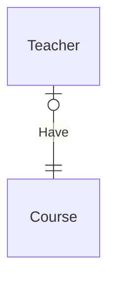

# Today - 2025-03-18 (Tue)

## Scrub
- MySQL 실습 환경 세팅
- SQL 응용 및 ERD 학습

## Learned
### 실습 환경 세팅
#### MySQL 활용
- Aiven에서 MySQL 서비스 생성
- Service URI 확인 후, DBeaver에서 사용

#### 클라이언트 설정
- **DBeaver**
  - `Database > New Database Connection`
  - `DB 종류 > MySQL`
  - `Connection Settings > Main > Server 섹션`
  - `Connected by: URL 선택 → Service URI에 jdbc: 추가`
  - **SSL 설정**
    - `Use SSL 체크`
    - `Verify server certificate 체크 해제`

- **DataGrip** 활용 가능
- AWS Redshift 관련 학습

### SQL 응용
#### Join
- 두 개의 테이블을 관련된 컬럼으로 결합하는 방식
- 성능 저하 가능성 있음 → 캐싱, 데이터 복제, 물리적 집계 테이블 활용

```sql
SELECT p.name AS product_name, p.price AS product_price, pr.created_at AS purchase_date
FROM purchase pr
JOIN product p ON pr.product_id = p.id
WHERE pr.user_id = 1;
```

#### View
- **가상의 테이블**을 생성하여 복잡한 쿼리를 단순화하고 재사용 가능
- 보안 강화 효과

```sql
CREATE VIEW view_name AS
SELECT col1, col2 FROM table1
JOIN table2 ON condition;
```

#### Union
- 서로 다른 테이블의 결과를 하나의 결과로 결합하는 연산자
- `UNION ALL`을 사용하면 중복 제거 없이 빠른 성능 유지 가능

```sql
SELECT col1 FROM table1
UNION
SELECT col1 FROM table2;
```

### ERD (Entity Relationship Diagram)
- 엔티티와 속성, 관계를 시각적으로 표현
- Cardinality(최대 관계) 및 Ordinality(최소 관계)를 직관적으로 확인



- **Crow’s Foot Notation** → 보편적 표기법
- **Peter Chen Notation** → 복잡한 데이터 구조 표현 가능
- **Barker Notation** → 관계를 명확히 표현

### Index
- 데이터 조회 최적화에 활용
- 단점: 저장공간 증가, 인덱스 유지 비용 증가

#### B-Tree 구조
- 인덱스 트리 구조로 검색 성능 최적화

## Keep
- 실습 환경을 활용한 SQL 쿼리 최적화 연습
- ERD를 활용한 데이터베이스 설계 능력 강화

## Problem
- Join, View, Union을 실무에서 적절히 적용하는 기준이 명확하지 않음
- ERD를 설계할 때 Cardinality 표현을 구체적으로 하는 것이 어려움

## Try
- 다양한 쿼리 패턴 실험 후 성능 비교
- ERD 디자인 패턴을 분석하고 실습 프로젝트에 적용

## 참고자료
- [Aiven MySQL](https://aiven.io/)
- [DBeaver](https://dbeaver.io/)
- [Crow’s Foot Notation](https://www.freecodecamp.org/news/crows-foot-notation-relationship-symbols-and-how-to-read-diagrams/)
- [Python 다중 상속](https://www.programiz.com/python-programming/multiple-inheritance)
- [Google Cloud Data Lakehouse](https://cloud.google.com/blog/products/data-analytics/open-data-lakehouse-on-google-cloud?hl=en)
